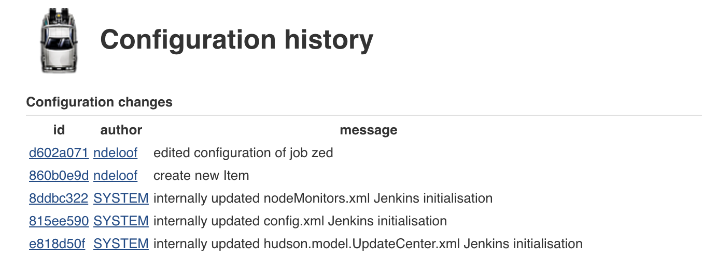
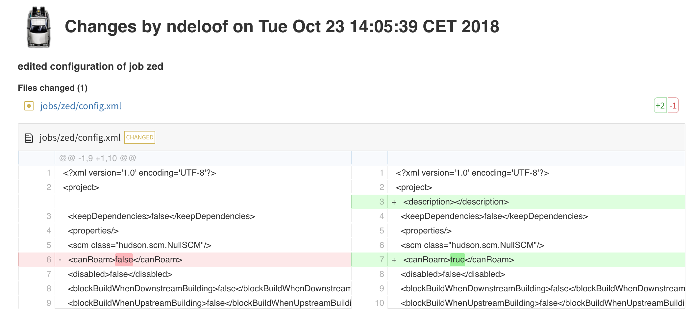

# Time Machine Jenkins plugin

This plugin help you track changes on Jenkins configuration. It records changes 
made to jenkins configuration as commits in a local git repository, logging author 
of changes so one can easily audit configuration changes.

Final goal is to provide sort of a combination of JobConfigHistory, scm-sync-configuration and audit-trail plugins

## Configuration

nothing to do, plugin is recording configuration changes once installed

## Usage 

Plugin do record changes to configuration on Jenkins master and store them as git commit.
Management link offers to review change history:

Detail pages allows to get details on the actual changes, from persisted configuration point of view.

## Status

The basic change collection infrastructure is implemented.
JENKINS_HOME is converted into a git repository, changes are tracked as commits
An UI is provided to list changes (i.e. commits) and diff 
 
## TODO 

 - [ ] Track item creation so we can log name and type
 - [ ] Option to push repo to a remote as a scheduled task
 - [ ] Option to revert changes from UI